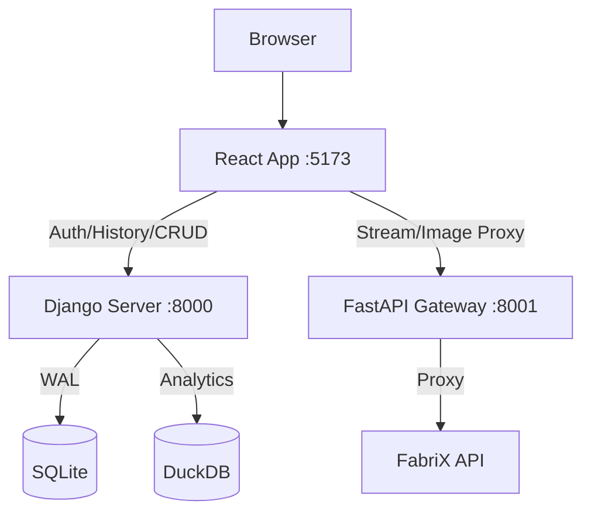

# Applications Development Guide

이 문서는 현재 개발 중인 애플리케이션(Application) 구성과 실행 방법을 정리한 가이드입니다.
프로젝트 명은 고정하지 않고, 앱 단위로 설명합니다.

## 1. 현재 애플리케이션 구성

현재 서비스는 아래 4개 앱으로 운영됩니다.

1. **FabriX Chat**
   - 목적: 모델 기반 채팅(Model Chat)
   - 주요 경로: `/chat`

2. **FabriX Agent Chat**
   - 목적: 에이전트 기반 채팅(Agent Chat)
   - 주요 경로: `/agent-chat`

3. **Data Explorer**
   - 목적: 파일 업로드/선택 후 시각적 데이터 분석
   - 주요 경로: `/data-explorer`

4. **Image Inspector**
   - 목적: 이미지/PDF 비교 분석
   - 주요 경로: `/image-compare`

## 2. 핵심 아키텍처



- **Frontend (5173)**: React + Vite
- **Django (8000)**: 인증, 세션/메시지 저장, Data Explorer API
- **FastAPI (8001)**: SSE streaming, 외부 API proxy, 이미지 처리

## 3. 기술 스택

- **Frontend**: React 19, Vite 5, Tailwind CSS
- **Backend**: Django 5+, DRF, FastAPI 0.109+
- **Database**: SQLite3 (WAL), DuckDB
- **Visualization**: Graphic Walker + `gw-dsl-parser`
- **Runtime**: Python 3.10+, Node.js 18+

## 4. 앱별 책임 분리

### 4.1 FabriX Chat
- Django: 채팅 세션/메시지 저장
- FastAPI: 모델 목록 조회, 메시지 SSE 전달

### 4.2 FabriX Agent Chat
- Django: 에이전트 채팅 세션/메시지 저장
- FastAPI: 에이전트 목록 조회, 메시지 SSE 전달

### 4.3 Data Explorer
- Django: 파일 메타데이터, 세션 초기화, 캐시 상태/재구축 API
- DuckDB: 서버 측 SQL 실행
- Frontend: Graphic Walker 기반 시각화 UI

### 4.4 Image Inspector
- FastAPI: 이미지/PDF 비교 및 고비용 연산 처리
- Frontend: 비교 결과 시각화/리포팅

## 5. 설치 및 실행 (Windows)

### 5.1 초기 설정
1. `setup_project.bat` 실행 (venv 생성 + dependency 설치)
2. 루트(`django_dev/`)에 `secrets.toml` 생성 및 API key 입력
3. `reset_create_admin.bat` 실행 (DB 초기화 + 관리자 계정 생성)

> `secrets.toml`은 Git에 포함되지 않습니다. 개발 PC마다 개별 생성이 필요합니다.

### 5.2 통합 실행
- 개발 모드: `run_project.bat`
- 서비스 모드: `service_project.bat`

### 5.3 서버 SQLite 유지 마이그레이션 (중요)

앱을 추가해도 서버의 기존 SQLite DB 파일을 삭제하지 않고 스키마만 안전하게 갱신하려면
루트의 `migrate_db.bat`를 사용합니다.

- 실행 명령: `migrate_db.bat`
- 목적: 기존 데이터 보존 + 자동 백업 + migration 적용 + 시스템 검증
- 원칙: **서버에서는 `makemigrations`를 생성하지 않고 `migrate`만 수행**

운영 서버 배포 원칙:
- 개발 환경에서 생성한 `django_server/apps/*/migrations/*.py` 파일을 **반드시 코드와 함께 배포**
- 운영 서버는 migration 파일을 생성하지 않고, 배포된 migration을 적용만 수행

`migrate_db.bat` 동작 순서:
1. `.venv` 활성화
2. `django_server/db.sqlite3` 자동 백업 (`django_server/backups/*.bak`)
3. `python manage.py makemigrations --check --dry-run`으로 누락 migration 검사
4. `python manage.py migrate --noinput` 적용
5. `python manage.py check` 검증

`--check --dry-run` 단계에서 실패하면,
개발 환경에서 migration 파일 생성/커밋 후 서버에서 다시 실행해야 합니다.

권장 배포 순서:
1. 개발 환경: `makemigrations` 실행 후 migration 파일 커밋
2. 운영 서버: 최신 코드 배포(pull)
3. 운영 서버: `migrate_db.bat` 실행

### 5.4 접속 경로
- App root: `http://localhost:5173`
- FabriX Chat: `http://localhost:5173/chat`
- FabriX Agent Chat: `http://localhost:5173/agent-chat`
- Data Explorer: `http://localhost:5173/data-explorer`
- Image Inspector: `http://localhost:5173/image-compare`

### 5.5 개별 실행 (필요 시)
```bash
# Django
.venv\Scripts\activate
cd django_server
python manage.py migrate
python manage.py runserver

# Frontend
cd frontend
npm install
npm run dev

# FastAPI
.venv\Scripts\activate
uvicorn ai_gateway.main:app --host 127.0.0.1 --port 8001 --reload
```

## 6. 필수 운영 규칙

- 민감정보는 루트 `secrets.toml`만 사용 (Git commit 금지)
- Frontend API layer 분리 유지
  - Django endpoint: `frontend/src/api/djangoApi.js`
  - FastAPI endpoint: `frontend/src/api/fastapiApi.js`
- FastAPI 외부 호출은 공유 `httpx.AsyncClient` 사용
- Django ORM에서 N+1 방지를 위해 `select_related`/`prefetch_related` 적용

## 7. 트러블슈팅 요약

- **CORS 오류**: `secrets.toml`의 `allowed_hosts` 및 Django/FastAPI CORS 설정 확인
- **429 오류**: `Retry-After` 기준 대기 후 재시도
- **SSE 문제**: `data: {...}\n\n` 형식과 `text/event-stream` 확인
- **SQLite lock**: 장시간 트랜잭션 제거, 동시 접근 로직 점검

## 8. 상세 문서

상세 구현/히스토리는 아래 문서를 참고합니다.

- `./.github/copilot-instructions.md`
- `./GEMINI.md`
- `./doc.md/MEMORY_APIS.md`
- `./doc.md/FEATURE_DATA_EXPLORER.md`
- `./doc.md/FEATURE_IMAGE_INSPECTOR.md`
- `./doc/chat_apis.html`
- `./doc/agent_apis.html`

Last updated: 2026-02-18
